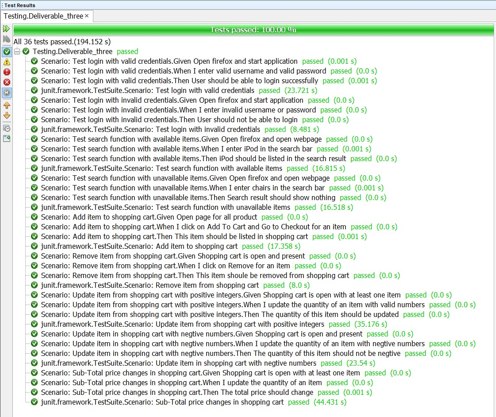
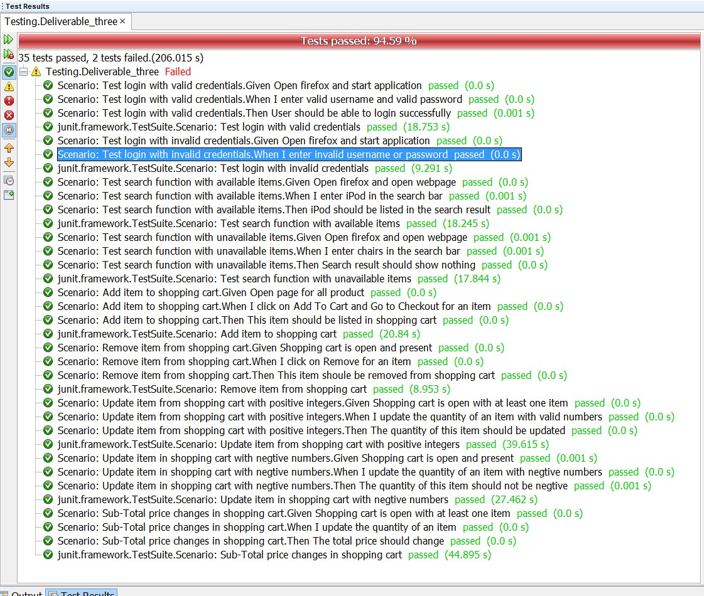

# IS2545 - DELIVERABLE 3: Selenium and Cucumber tests

By Gaole Yu gay8@pitt.edu

1. Issues that faced:

  * It takes some time to work with Selenium and Cucumber at the beginning
  * The website was very slow and some tests failed due to this reason
  * Hard to use xpath to locate an element

2. Features (Stories)

    * Feature 1: As a user, I should be ablt to login with valid credentials
      * Scenario 1: Test login with valid credentials        
         * Given Open firefox and start application
         * When I enter valid username and valid password
         * Then User should be able to login successfully
      * Scenario 2: Test login with invalid credentials        
         * Given Open firefox and start application
         * When I enter invalid username and valid password
         * Then User should not be able to login
    * Feature 2: As a user, I can add, remove and update shopping cart
      * Scenario 1: Add item to shopping cart        
         * Given Open page for all product
         * When I click on Add To Cart and Go to Checkout for an item
         * Then This item should be listed in shopping cart
      * Scenario 2: Remove item from shopping cart        
         * Given Shopping cart is open and present
         * When I click on Remove for an item
         * Then This item shoule be removed from shopping cart
      * Scenario 3: Update item from shopping cart with positive integers        
         * Given Shopping cart is open with at least one item
         * When I update the quantity of an item with valid numbers
         * Then The quantity of this item should be updated
      * Scenario 4: Update item in shopping cart with negtive numbers       
         * Given Shopping cart is open and present
         * When I update the quantity of an item with negtive numbers
         * Then The quantity of this item should not be negtive
      * Scenario 5: Sub-Total price changes in shopping cart        
         * Given Shopping cart is open with at least one item
         * When I update the quantity of an item
         * Then The total price should change
    * Feature 3: As a user, I can search items so that I can find them
      * Scenario 1: Test search function with available items       
         * Given Open firefox and open webpage
         * When I enter iPod in the search bar
         * Then iPod should be listed in the search result
      * Scenario 2: Test search function with unavailable items        
         * Given Open firefox and open webpage
         * When I enter chairs in the search bar
         * Then Search result should show nothing

3. Test results with 100% pass.

  

4. Test Results with 94.59% pass due to IP address is blocked by the remote server.

  

5. Test results with 84.21% pass due to slowness of the website. Web elements cannot be fully loaded.

  
