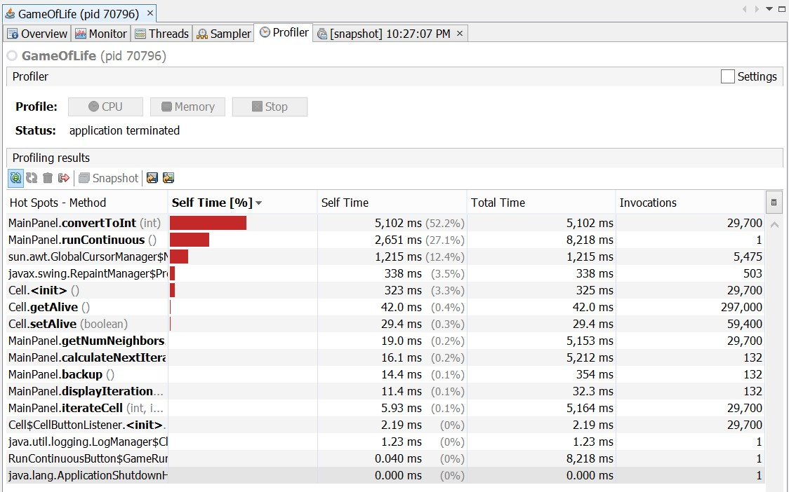
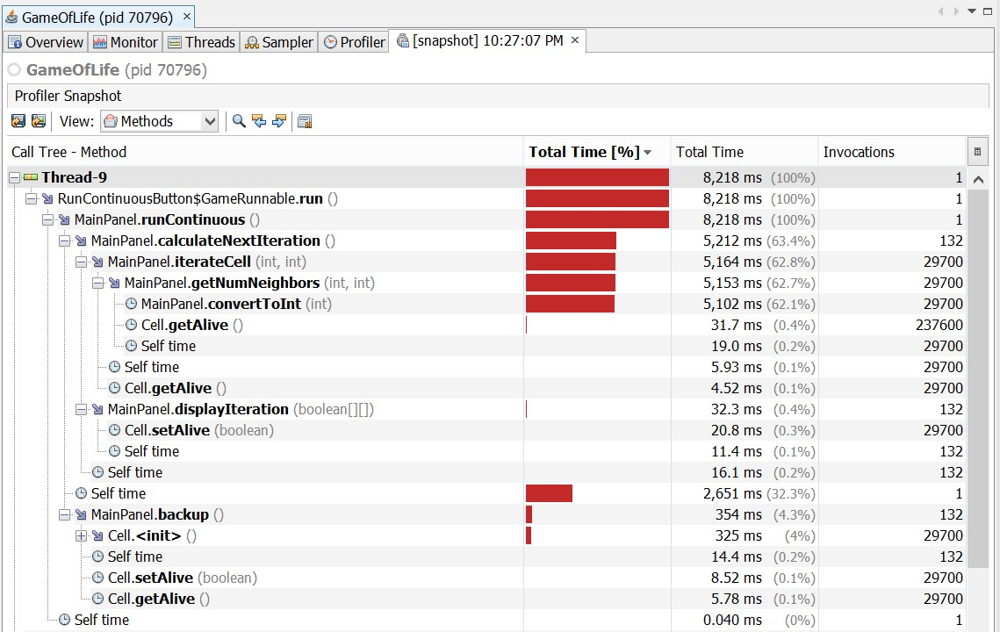
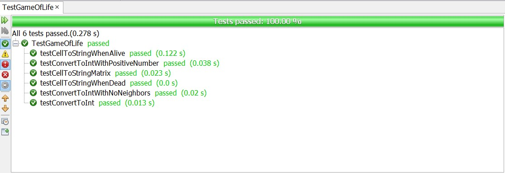
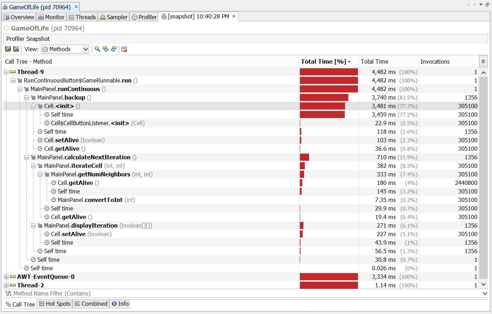
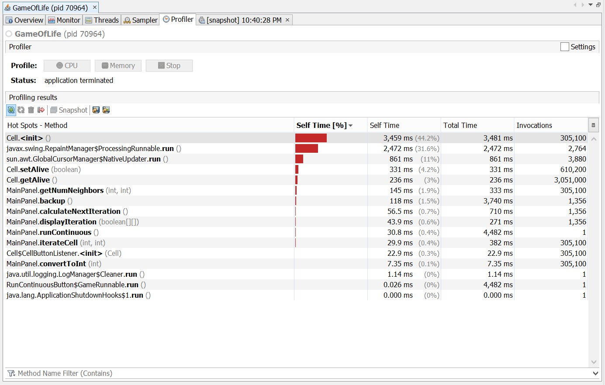

# IS2545 - DELIVERABLE 4: Game Of Life

By Gaole Yu gay8@pitt.edu

1. Refactored methods and reasons:
 * convertToInt() method in MainPanel class
    * It takes 52.2% of the total time.
    * Major part of the code in this method is unnecessary.
    * It takes many computing resources.
 * runContinuous() method in MainPanel class
    * It takes 27.1% of the total time.
    * Thread sleep and for loop are unnecessary.
 * toString() method in MainPanel class
    * It takes 3.3% of the total time.
    * for loop and if condition are unnecessary.

2. Pinning tests:
 * convertToInt() method
    * Test convertToInt() with 0
    * Test convertToInt() with positive integers
    * Test convertToInt() with a cell without neighbors.
 * runContinuous() method
    * Manual tested.
    * runContinuous() consists of backup() and calculateNextIteration() and these two methods do not return any value.
 * toString() method
    * Test if toString() returns "X" when a cell is alive
    * Test if toString() returns "." when a cell is dead
    * Test if toString() returns "." for a dead cell in a cell matrix

3. The profiling results before refactor.

  

4. The snapshot before refactor.

  

5. Test results after refactor.

  

6. The profiling results after refactor.

  

7. The snapshot after refactor.

  
