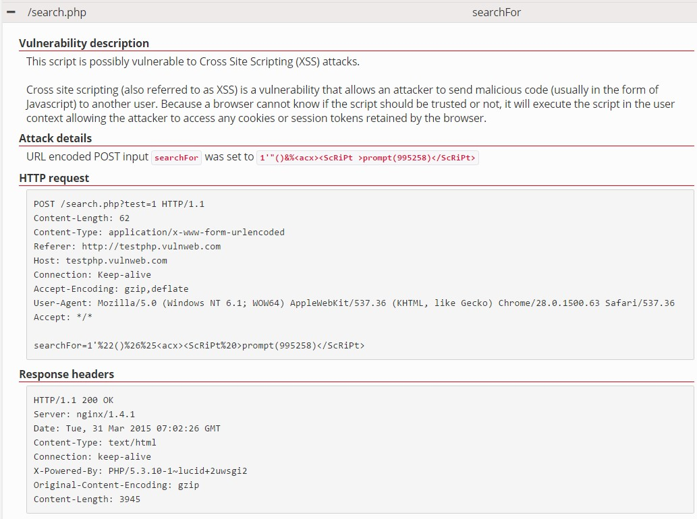
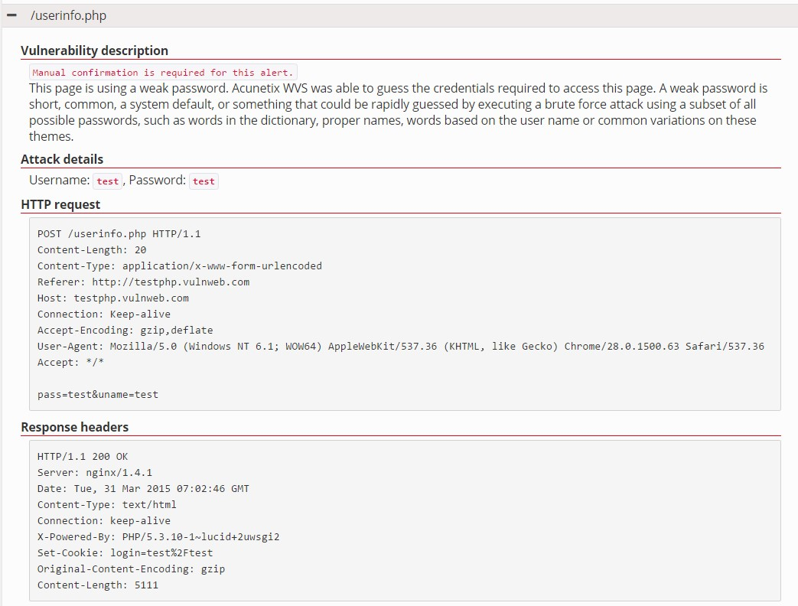
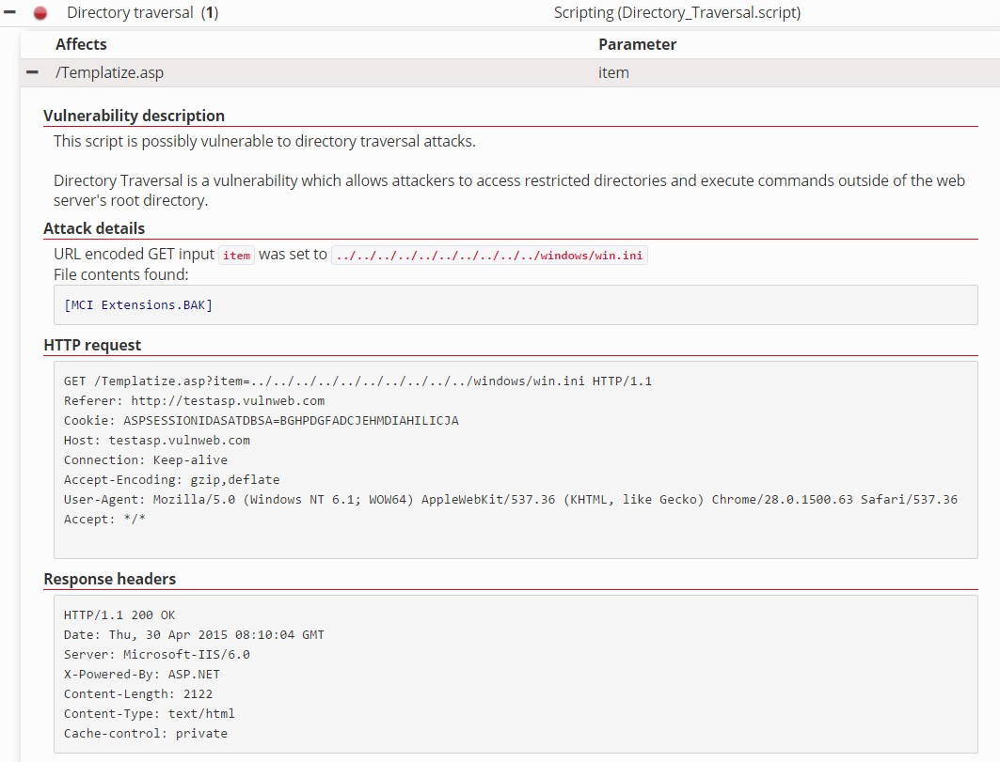

# IS2545 - DELIVERABLE 5: Web Security Vulnerabilities

By Gaole Yu (gay8@pitt.edu) and Simiao Wang (siw20@pitt.edu)

1. Tools used
  * Acunetix Vulnerability Online Scanner

2. Vulnerabilities
    * Vulnerability 1
        * Website URL: http://testphp.vulnweb.com/
        * Steps taken to exploit the Vulnerability
            * Type http://testphp.vulnweb.com/ into Acunetix Online Scanner
            * Perform a full scan over the Website
            * Select Cross site scripting after the scan is complete
            * Select and expand "search.php" in Cross site scripting
            * The parameter of this vulnerability is "searchFor"
        *  Screenshot
        
        * InfoSec Triad that this vulnerability attacks
            * Confidentiality, by stealing session cookie.
            * Integrity, by modifying the content.
            * Availability, by taking over the account and impersonating.
        * The security attack can exploit this vulnerability
            * Fabrication
            * Deception
        * Attacks are active to exploit this vulnerability
        * This vulnerability may lead
            * Data loss, due to impersonating user and stealing session cookie
            * Unauthorized accesses, due to impersonating user
            * Information disclosure, due to impersonating user and modification page of content
            * Denial of service, due to modification of page content
            * Repudiation
        * Steps should the development team take to fix this vulnerability
            * The script should filter meta-characters from user input
            * Test the code after revision
    * vulnerability 2
        * Website URL: http://testphp.vulnweb.com/
        * Steps taken to exploit the vulnerability
            * Type http://testphp.vulnweb.com/ into Acunetix Online Scanner
            * Perform a full scan over the Website
            * Select "Weak password" after the scan is complete
            * Expand "Weak password"
            * Type "test" in username and password
        * Screenshot
        
        * InfoSec Triad that this vulnerability may attack
            * Confidentiality, by using users' credentials.
            * Integrity, by modifying data with users' credentials.
            * Availability, by modifying users' credentials and accounts.
        * The security attack can exploit this vulnerability
            * Fabrication
        * Attacks are active to exploit this vulnerability.
        * This vulnerability may lead
            * Unauthorized accesses, due to credentials disclosure.
            * Information disclosure, due to credentials disclosure.
        * Steps should the development team take to fix this vulnerability.
            * Enforce a strong password policy.
            * Do not allow weak passwords or passwords based on dictionary.
    * Vulnerability 3
        * Website URL: http://testasp.vulnweb.com
        * Steps taken to exploit the Vulnerability
            * Type http://testasp.vulnweb.com into Acunetix Online Scanner.
            * Perform a full scan over the Website
            * Find "Directory traversal" after the scan is complete.
            * Locate and expand "Templatize.asp" in Cross site scripting.
            * The parameter of this vulnerability is "item".
            * FILE "MCI Extensions.BAK" is found.
        *  Screenshot
        
        * InfoSec Triad that this vulnerability attacks
            * Confidentiality, by reading the file found in the system.
        * The security attack can exploit this vulnerability
            * Fabrication
            * Deception
        * Attacks are active to exploit this vulnerability
        * This vulnerability may lead
            * Unauthorized accesses, unknown user can access the file
            * Information disclosure, due to file is exposed
        * Steps should the development team take to fix this vulnerability
            * The script should filter meta-characters from user input
            * Test after revision
